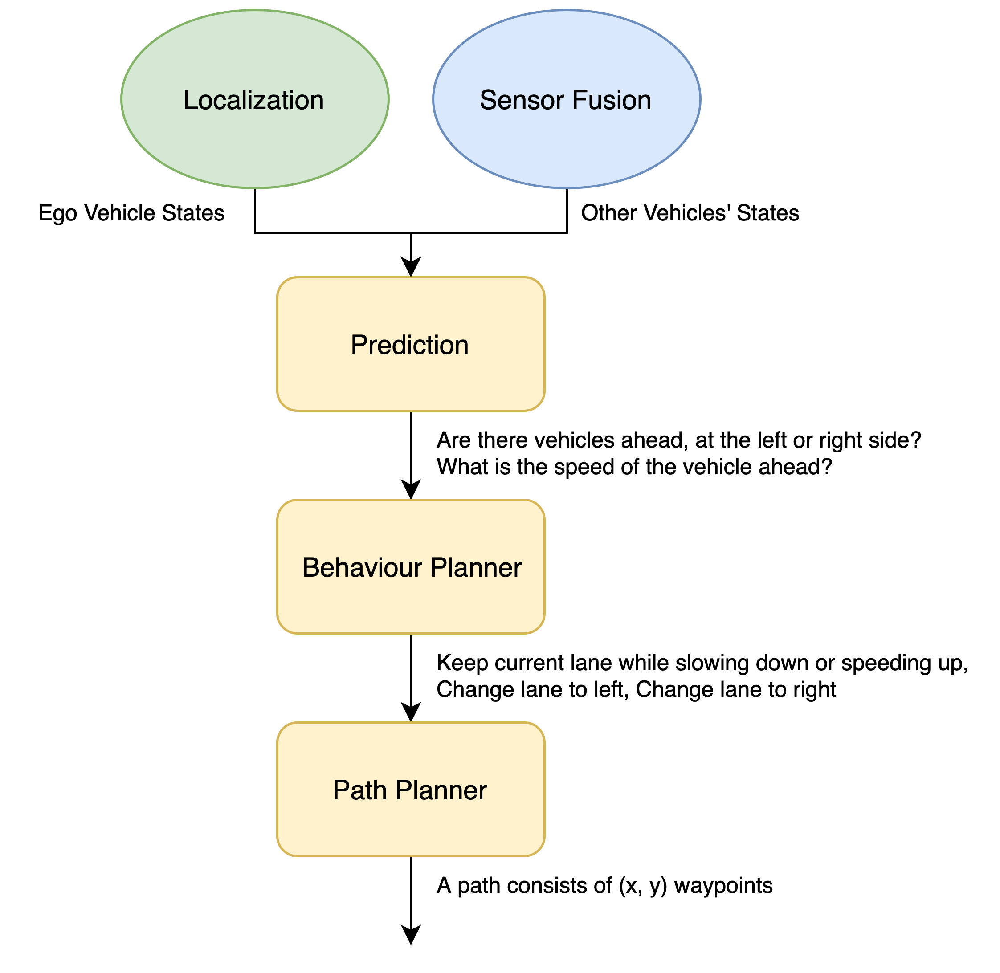
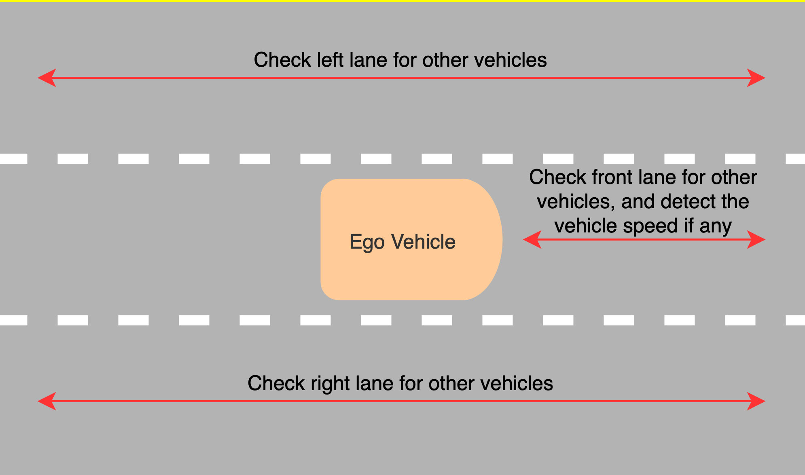
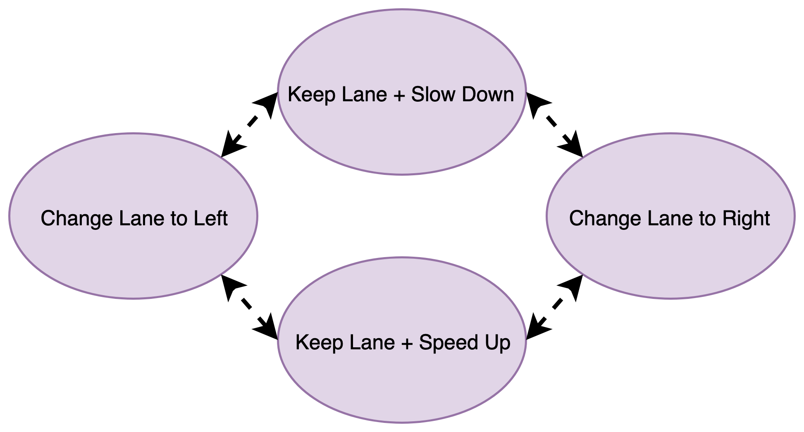
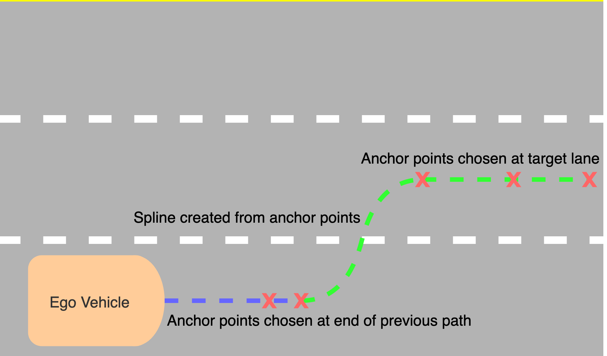
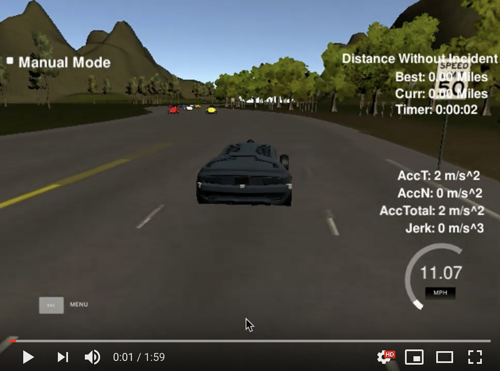

# **Highway Driving**

## **Objective**

This project describes an implementation of path planner that is able to create smooth, safe paths for the car to follow along a 3 lane highway with traffic.

## **Algorithm Overview**

  

This system has three components:

* Prediction - This system intends to reason about the environment. It receives information about the ego vehicle's states and other vehicles' states from localization and sensor fusion modules. It allows us to know:

  * Is there a vehicle in front of us blocking the traffic, and what is the speed of this vehicle?
  * Is there a vehicle to the left of us making a lane change not safe?
  * Is there a vehicle to the right of us making a lane change not safe?

These questions are answered by calculating the lane the other vehicle is and the position the vehicle will be when the ego vehicle fully tranverse previous path trajectory. A vehicle is considered "dangerous" when its distance to ego vehicle is less than 30 meters in front or behind.

* Behavior Planning - This system decides what action to take given the inputs from the prediction module.

  * If we have a car in front of us, can we change to left or right lane?
  * Should we slow down or speed up?

These questions are answered based on the predictions of the environment. Specifically, if there is a vehicle in front of us, lane change to free lane is taken. If this action is unable to be performed, then the ego vehicle is slowed down to the speed of the front vehicle. On the other hand, if there is no vehicle in front of us, ego vehicle is sped up until speed limit.

* Path Planning - This system creates the trajectory waypoints given target lane and intended speed from behavior planning module.

In order to ensure continuity on the trajectory, the last two points of the previous path trajectory (or the current vehicle position if there is no previous path trajectory) are used in conjunction with three points on the target lane to initialize the spline calculation. Then, new waypoints can be determined by evaluating the spline. These new waypoints are then appended to the previous path waypoints to form a new trajectory.

**Prediction**

  

**Behavior Planner**

  

**Path Planner**

  

**Results**

  

